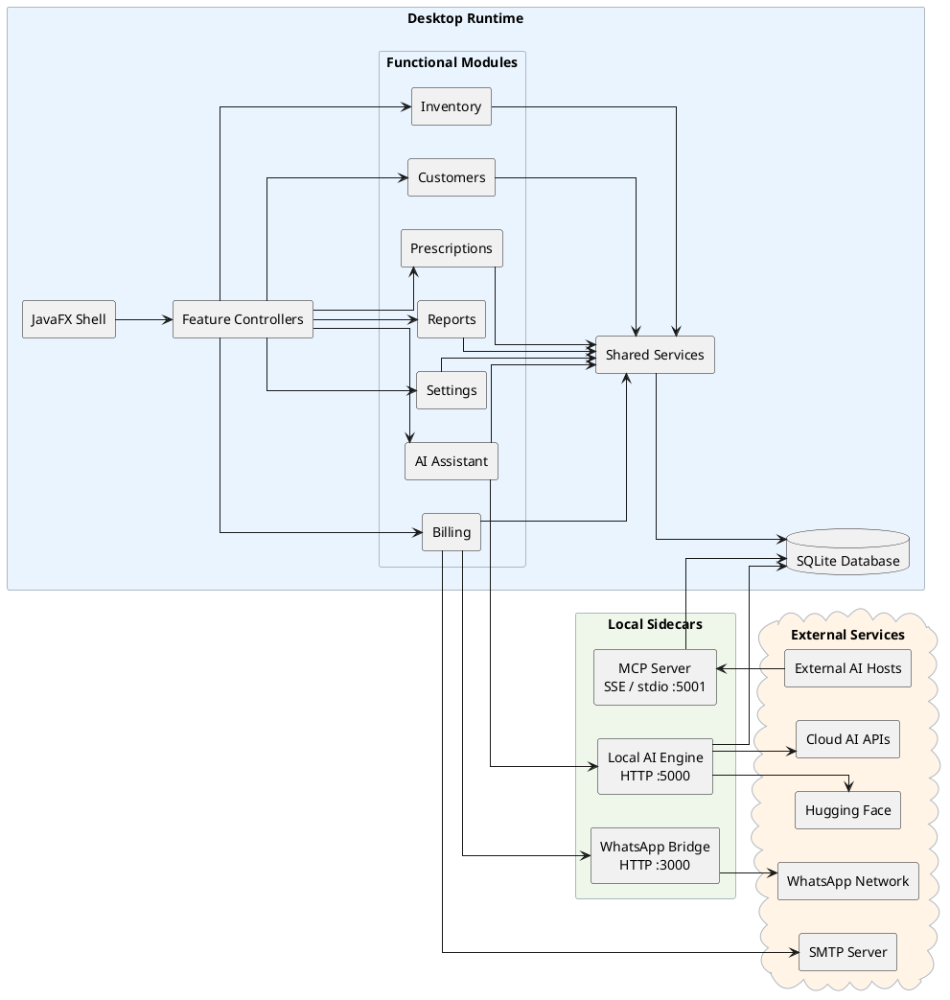
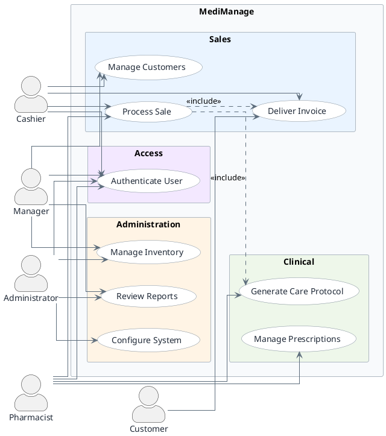
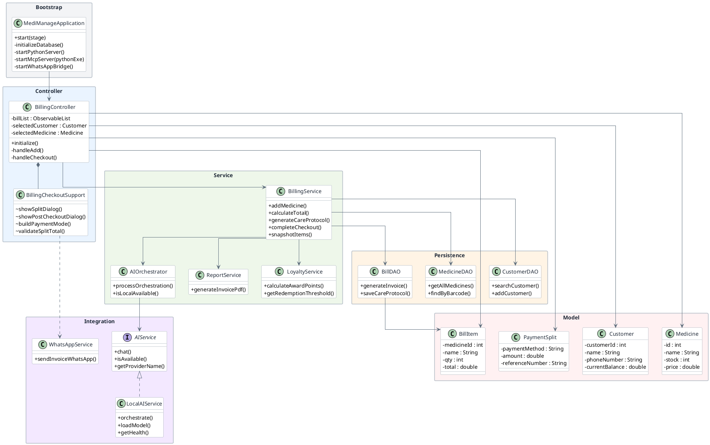
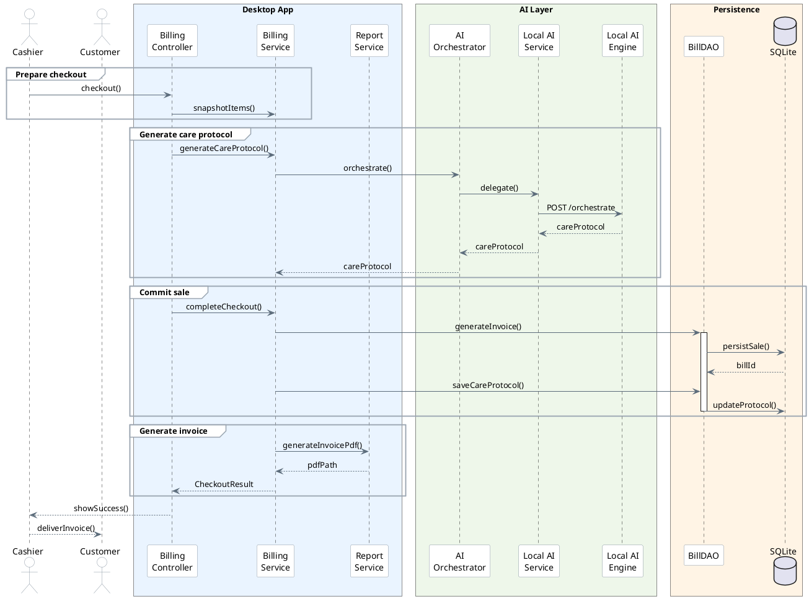
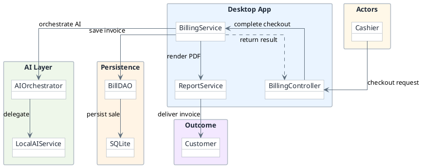
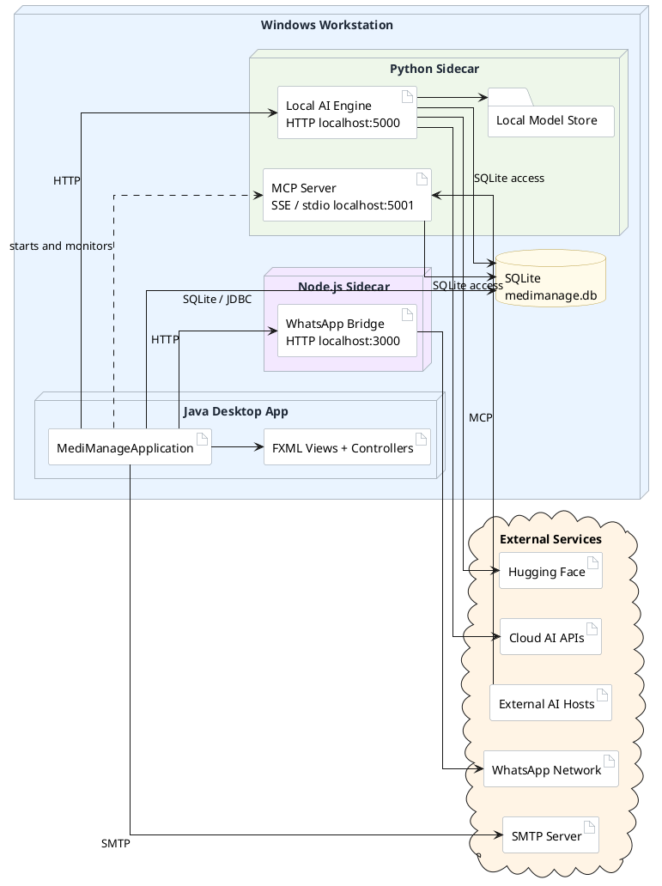
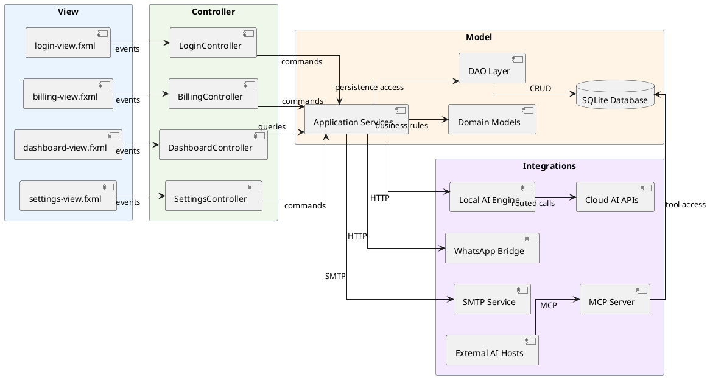

## Module Diagram

```plantuml
@startuml
left to right direction
skinparam shadowing false
skinparam packageStyle rectangle
skinparam linetype ortho
skinparam defaultTextAlignment center
skinparam package {
  BorderColor #AEB8C2
  FontColor #1F2937
}
skinparam componentStyle rectangle

package "Desktop Runtime" #EAF4FF {
  [JavaFX Shell] as Shell
  [Feature Controllers] as Controllers
  [Shared Services] as Services
  database "SQLite Database" as DB

  package "Functional Modules" {
    [Billing] as Billing
    [Inventory] as Inventory
    [Customers] as Customers
    [Prescriptions] as Prescriptions
    [Reports] as Reports
    [Settings] as Settings
    [AI Assistant] as AIAssistant
  }
}

package "Local Sidecars" #EEF7EA {
  [Local AI Engine\nHTTP :5000] as LocalAI
  [MCP Server\nSSE / stdio :5001] as MCP
  [WhatsApp Bridge\nHTTP :3000] as WA
}

cloud "External Services" #FFF4E5 {
  [Cloud AI APIs] as CloudAI
  [Hugging Face] as HF
  [SMTP Server] as SMTP
  [WhatsApp Network] as WAN
  [External AI Hosts] as AIHosts
}

Shell --> Controllers
Controllers --> Billing
Controllers --> Inventory
Controllers --> Customers
Controllers --> Prescriptions
Controllers --> Reports
Controllers --> Settings
Controllers --> AIAssistant

Billing --> Services
Inventory --> Services
Customers --> Services
Prescriptions --> Services
Reports --> Services
Settings --> Services
AIAssistant --> Services

Services --> DB
AIAssistant --> LocalAI
LocalAI --> DB
LocalAI --> CloudAI
LocalAI --> HF
Billing --> WA
Billing --> SMTP
WA --> WAN
AIHosts --> MCP
MCP --> DB
@enduml
```

## Use Case Diagram

```plantuml
@startuml
left to right direction
skinparam shadowing false
skinparam packageStyle rectangle
skinparam linetype ortho
skinparam actorStyle awesome
skinparam ArrowColor #5B6B7A
skinparam ArrowThickness 1
skinparam rectangle {
  BorderColor #AEB8C2
  BackgroundColor #F8FAFC
}
skinparam usecase {
  BackgroundColor #FFFFFF
  BorderColor #7C8A97
  FontColor #1F2937
}
skinparam actor {
  FontColor #1F2937
}

actor Cashier
actor Pharmacist
actor Manager
actor Administrator
actor Customer

rectangle "MediManage" #F8FAFC {
  rectangle "Access" #F3E8FF {
    usecase "Authenticate User" as UC1
  }

  rectangle "Sales" #EAF4FF {
    usecase "Manage Customers" as UC2
    usecase "Process Sale" as UC3
    usecase "Deliver Invoice" as UC4
  }

  rectangle "Clinical" #EEF7EA {
    usecase "Manage Prescriptions" as UC5
    usecase "Generate Care Protocol" as UC6
  }

  rectangle "Administration" #FFF4E5 {
    usecase "Manage Inventory" as UC7
    usecase "Review Reports" as UC8
    usecase "Configure System" as UC9
  }
}

Cashier --> UC1
Pharmacist --> UC1
Manager --> UC1
Administrator --> UC1

Cashier --> UC2
Cashier --> UC3
Cashier --> UC4

Pharmacist --> UC3
Pharmacist --> UC5
Pharmacist --> UC6

Manager --> UC2
Manager --> UC7
Manager --> UC8

Administrator --> UC7
Administrator --> UC8
Administrator --> UC9

Customer --> UC4

UC3 ..> UC4 : <<include>>
UC3 ..> UC6 : <<include>>
@enduml
```

## Class Diagram

```plantuml
@startuml
top to bottom direction
skinparam shadowing false
skinparam classAttributeIconSize 0
skinparam linetype ortho
skinparam packageStyle rectangle
skinparam ArrowColor #5B6B7A
skinparam class {
  BackgroundColor #FFFFFF
  BorderColor #8C98A4
  FontColor #1F2937
}
skinparam package {
  BorderColor #AEB8C2
  FontColor #1F2937
}

package "Bootstrap" #F3F4F6 {
  class MediManageApplication {
    +start(stage)
    -initializeDatabase()
    -startPythonServer()
    -startMcpServer(pythonExe)
    -startWhatsAppBridge()
  }
}

package "Controller" #EAF4FF {
  class BillingController {
    -billList : ObservableList
    -selectedCustomer : Customer
    -selectedMedicine : Medicine
    +initialize()
    -handleAdd()
    -handleCheckout()
  }

  class BillingCheckoutSupport {
    ~showSplitDialog()
    ~showPostCheckoutDialog()
    ~buildPaymentMode()
    ~validateSplitTotal()
  }
}

package "Service" #EEF7EA {
  class BillingService {
    +addMedicine()
    +calculateTotal()
    +generateCareProtocol()
    +completeCheckout()
    +snapshotItems()
  }

  class ReportService {
    +generateInvoicePdf()
  }

  class LoyaltyService {
    +calculateAwardPoints()
    +getRedemptionThreshold()
  }

  class AIOrchestrator {
    +processOrchestration()
    +isLocalAvailable()
  }
}

package "Persistence" #FFF4E5 {
  class BillDAO {
    +generateInvoice()
    +saveCareProtocol()
  }

  class CustomerDAO {
    +searchCustomer()
    +addCustomer()
  }

  class MedicineDAO {
    +getAllMedicines()
    +findByBarcode()
  }
}

package "Integration" #F3E8FF {
  interface AIService {
    +chat()
    +isAvailable()
    +getProviderName()
  }

  class LocalAIService {
    +orchestrate()
    +loadModel()
    +getHealth()
  }

  class WhatsAppService {
    +sendInvoiceWhatsApp()
  }
}

package "Model" #FFF1F2 {
  class BillItem {
    -medicineId : int
    -name : String
    -qty : int
    -total : double
  }

  class Customer {
    -customerId : int
    -name : String
    -phoneNumber : String
    -currentBalance : double
  }

  class Medicine {
    -id : int
    -name : String
    -stock : int
    -price : double
  }

  class PaymentSplit {
    -paymentMethod : String
    -amount : double
    -referenceNumber : String
  }
}

MediManageApplication --> BillingController
BillingController *-- BillingCheckoutSupport
BillingController --> BillingService
BillingController --> Customer
BillingController --> Medicine
BillingController --> BillItem
BillingController --> PaymentSplit

BillingService --> BillDAO
BillingService --> CustomerDAO
BillingService --> MedicineDAO
BillingService --> ReportService
BillingService --> LoyaltyService
BillingService --> AIOrchestrator

AIOrchestrator --> AIService
AIService <|.. LocalAIService
BillingCheckoutSupport ..> WhatsAppService
BillDAO --> BillItem
@enduml
```

## Sequence Diagram

```plantuml
@startuml
skinparam shadowing false
skinparam sequenceMessageAlign center
skinparam responseMessageBelowArrow true
skinparam ArrowColor #5B6B7A
skinparam ParticipantPadding 18
skinparam BoxPadding 10
skinparam SequenceGroupBorderColor #9AA5B1
skinparam SequenceGroupBackgroundColor #FFFFFF
skinparam ParticipantBackgroundColor #FFFFFF
skinparam ParticipantBorderColor #8C98A4
skinparam LifeLineBorderColor #B8C1CC
skinparam LifeLineBackgroundColor #FAFBFC
skinparam ActorBorderColor #8C98A4
skinparam ActorBackgroundColor #FFFFFF

actor Cashier
actor Customer

box "Desktop App" #EAF4FF
participant "Billing\nController" as BC
participant "Billing\nService" as BS
participant "Report\nService" as RS
end box

box "AI Layer" #EEF7EA
participant "AI\nOrchestrator" as AI
participant "Local AI\nService" as LAS
participant "Local AI\nEngine" as PY
end box

box "Persistence" #FFF4E5
participant "BillDAO" as DAO
database SQLite as DB
end box

group Prepare checkout
  Cashier -> BC : checkout()
  BC -> BS : snapshotItems()
end

group Generate care protocol
  BC -> BS : generateCareProtocol()
  BS -> AI : orchestrate()
  AI -> LAS : delegate()
  LAS -> PY : POST /orchestrate
  PY --> LAS : careProtocol
  LAS --> AI : careProtocol
  AI --> BS : careProtocol
end

group Commit sale
  BC -> BS : completeCheckout()
  BS -> DAO : generateInvoice()
  activate DAO
  DAO -> DB : persistSale()
  DB --> DAO : billId
  BS -> DAO : saveCareProtocol()
  DAO -> DB : updateProtocol()
  deactivate DAO
end

group Generate invoice
  BS -> RS : generateInvoicePdf()
  RS --> BS : pdfPath
  BS --> BC : CheckoutResult
end

BC --> Cashier : showSuccess()
Cashier --> Customer : deliverInvoice()
@enduml
```

## Collaboration Diagram

```plantuml
@startuml
skinparam shadowing false
skinparam packageStyle rectangle
skinparam linetype ortho
skinparam nodesep 80
skinparam ranksep 80
skinparam ArrowColor #5B6B7A

skinparam object {
  BackgroundColor #FFFFFF
  BorderColor #8C98A4
  FontColor #1F2937
}

skinparam package {
  BorderColor #AEB8C2
  FontColor #1F2937
}

package "Actors" #FFF8E8 {
  object "Cashier" as Cashier
}

package "Desktop App" #EAF4FF {
  object "BillingController" as BC
  object "BillingService" as BS
  object "ReportService" as RS
}

package "AI Layer" #EEF7EA {
  object "AIOrchestrator" as AI
  object "LocalAIService" as LAS
}

package "Persistence" #FFF4E5 {
  object "BillDAO" as DAO
  object "SQLite" as DB
}

package "Outcome" #F3E8FF {
  object "Customer" as Customer
}

' --- Sibling Order Enforcement ---
' This hidden rule forces AI to the left, ReportService in the center, and Persistence to the right
AI -[hidden]right-> RS
RS -[hidden]right-> DAO

' --- Main Vertical Spine ---
Cashier --> BC : checkout request
BC --> BS : complete checkout

' Return arrow formatted as a dotted line pointing back up
BS ..> BC : return result

BS --> RS : render PDF
RS --> Customer : deliver invoice

' --- Diagonal Branches ---
' By simply pointing down, the engine naturally swings them left and right 
BS --> AI : orchestrate AI
AI --> LAS : delegate

BS --> DAO : save invoice
DAO --> DB : persist sale

@enduml
```

## Deployment Diagram

```plantuml
@startuml
left to right direction
skinparam shadowing false
skinparam linetype ortho
skinparam node {
  BorderColor #AEB8C2
  FontColor #1F2937
}
skinparam artifact {
  BackgroundColor #FFFFFF
  BorderColor #8C98A4
}
skinparam database {
  BackgroundColor #FFFBEA
  BorderColor #B89B3C
}
skinparam folder {
  BackgroundColor #FFFFFF
  BorderColor #8C98A4
}

node "Windows Workstation" as WS #EAF4FF {
  node "Java Desktop App" as Desktop #EAF4FF {
    artifact "MediManageApplication" as APP
    artifact "FXML Views + Controllers" as UI
  }

  database "SQLite\nmedimanage.db" as DB

  node "Python Sidecar" as PythonSidecar #EEF7EA {
    artifact "Local AI Engine\nHTTP localhost:5000" as AI
    artifact "MCP Server\nSSE / stdio localhost:5001" as MCP
    folder "Local Model Store" as MODELS
  }

  node "Node.js Sidecar" as NodeSidecar #F3E8FF {
    artifact "WhatsApp Bridge\nHTTP localhost:3000" as WA
  }
}

cloud "External Services" #FFF4E5 {
  artifact "External AI Hosts" as HOSTS
  artifact "Cloud AI APIs" as CloudAI
  artifact "Hugging Face" as HF
  artifact "SMTP Server" as SMTP
  artifact "WhatsApp Network" as WAN
}

APP --> UI
APP --> DB : SQLite / JDBC
APP --> AI : HTTP
APP --> WA : HTTP
APP --> SMTP : SMTP
APP ..> MCP : starts and monitors

AI --> DB : SQLite access
AI --> MODELS
AI --> CloudAI
AI --> HF

HOSTS --> MCP : MCP
MCP --> DB : SQLite access
WA --> WAN
@enduml
```

## System Architecture MVC

```plantuml
@startuml
left to right direction
skinparam shadowing false
skinparam packageStyle rectangle
skinparam linetype ortho
skinparam package {
  BorderColor #AEB8C2
  FontColor #1F2937
}
skinparam rectangle {
  BorderColor #8C98A4
}

package "View" #EAF4FF {
  [login-view.fxml] as LoginView
  [billing-view.fxml] as BillingView
  [dashboard-view.fxml] as DashboardView
  [settings-view.fxml] as SettingsView
}

package "Controller" #EEF7EA {
  [LoginController] as LoginController
  [BillingController] as BillingController
  [DashboardController] as DashboardController
  [SettingsController] as SettingsController
}

package "Model" #FFF4E5 {
  [Application Services] as Services
  [Domain Models] as Domain
  [DAO Layer] as DAOs
  database "SQLite Database" as SQLite
}

package "Integrations" #F3E8FF {
  [Local AI Engine] as LocalAI
  [WhatsApp Bridge] as WhatsApp
  [SMTP Service] as Mail
  [Cloud AI APIs] as CloudAI
  [MCP Server] as MCP
  [External AI Hosts] as AIHosts
}

LoginView --> LoginController : events
BillingView --> BillingController : events
DashboardView --> DashboardController : events
SettingsView --> SettingsController : events

LoginController --> Services : commands
BillingController --> Services : commands
DashboardController --> Services : queries
SettingsController --> Services : commands

Services --> Domain : business rules
Services --> DAOs : persistence access
DAOs --> SQLite : CRUD

Services --> LocalAI : HTTP
LocalAI --> CloudAI : routed calls
Services --> WhatsApp : HTTP
Services --> Mail : SMTP

AIHosts --> MCP : MCP
MCP --> SQLite : tool access
@enduml
```

