# MediManage UML Diagrams

This document contains all UML diagrams for the MediManage project in Mermaid format. You can:
1. **View these directly** in any Markdown viewer that supports Mermaid (GitHub, VS Code with Mermaid extension)
2. **Convert to images** using online tools like https://mermaid.live or https://mermaid.ink
3. **Copy to PowerPoint** by taking screenshots or exporting as PNG/SVG

---

## 1. Use Case Diagram

---

## 2. Class Diagram - Main Model Classes

---

## 3. Class Diagram - DAO and Service Layer

---

## 4. Sequence Diagram - User Login Flow

---

## 5. Sequence Diagram - Generate Invoice (Billing)

---

## 6. Sequence Diagram - View Dashboard KPIs

---

## 7. Component Diagram

---

## 8. Deployment Diagram

```mermaid
graph TB
    subgraph "Windows PC - Client Workstation"
        subgraph AppLayer["Application Components"]
            MediApp["MediManage.exe<br/>JavaFX Application"]
            JRE["Bundled JRE 21<br/>Java Runtime"]
        end
        
        subgraph UILayer["UI Layer"]
            UI["JavaFX Views<br/>Login | Dashboard<br/>Billing | Inventory"]
        end
        
        subgraph BizLayer["Business Logic"]
            BL["Controllers<br/>Services<br/>DAOs"]
        end
        
        subgraph DataLayer["Data Layer"]
            SQLite["SQLite Engine"]
            DBFile["medimanage.db<br/>C:\Program Files\MediManage\runtime\db\"]
        end
        
        subgraph ConfigLayer["Configuration"]
            Config["Config Files<br/>%APPDATA%\MediManage\"]
        end
    end
    
    subgraph "Hardware Peripherals"
        Scanner["🔲 Barcode Scanner<br/>USB Connection<br/>Acts as Keyboard Input"]
        Printer["🖨️ Thermal Printer<br/>POS-58<br/>USB/Network<br/>ESC/POS Protocol"]
    end
    
    subgraph "Installation Package"
        Installer["📦 MediManage_Setup_0.1.5.exe<br/>Size: ~120 MB<br/>Platform: Windows 10/11<br/>Includes: JRE + App + DB"]
    end
    
    MediApp --> JRE
    MediApp --> UI
    UI --> BL
    BL --> SQLite
    SQLite --> DBFile
    BL --> Config
    
    Scanner -.USB.-> MediApp
    Printer -.USB/Network.-> MediApp
    
    Installer -.Installs.-> MediApp
    
    style MediApp fill:#4CAF50
    style Scanner fill:#FFC107
    style Printer fill:#2196F3
    style Installer fill:#9C27B0
    style DBFile fill:#FF5722
```

---

## 9. Simplified Collaboration Diagram - Generate Invoice

---

## How to Use These Diagrams

### For Your PPT Presentation:

1. **Online Conversion** (Recommended):
   - Copy each Mermaid code block
   - Go to https://mermaid.live
   - Paste the code
   - Export as PNG or SVG (high quality)
   - Insert into PowerPoint

2. **Direct Screenshot**:
   - View this file in VS Code with Mermaid extension
   - Take screenshots of rendered diagrams
   - Insert into PowerPoint

3. **GitHub Rendering**:
   - Push this file to GitHub
   - GitHub automatically renders Mermaid
   - Take screenshots from GitHub

### Tips for Your Review:

- **Use Case Diagram**: Shows all features and who can access them
- **Class Diagrams**: Shows your code structure (models, DAOs, services, controllers)
- **Sequence Diagrams**: Shows how login, billing, and dashboard work step-by-step
- **Component Diagram**: Shows how your code is organized into packages
- **Deployment Diagram**: Shows the physical installation on Windows PC with peripherals

### Explanation Points for Your Review:

1. **Architecture**: "We use MVC pattern with DAO layer for clean separation"
2. **Technology**: "JavaFX for UI, SQLite for embedded database, no server needed"
3. **Deployment**: "Standalone Windows app with bundled Java - easy installation"
4. **Features**: "Complete POS system with billing, inventory, reports, and financial tracking"
5. **Security**: "Role-based access control with 4 user levels"
